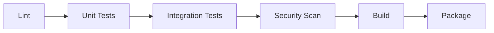

# Build Document — Generation Template

> **Domain:** build
> **Source standard:** `documentation-standards/14-build-standards.md`
> **Coherence source:** `audit/semantic/document/14-build.md`
> **Relationships:** `audit/deterministic/document/14-build-relationships.yaml`

Generate a complete Build Plan document for a system. The document must satisfy every required section below, in the order defined by the standard.

## Required Sections

| # | Section | semantic_type | Required | Content Requirements |
|---|---------|--------------|----------|---------------------|
| 1 | Purpose | `purpose` | | What Build defines, scope boundaries, relationship to other standards |
| 2 | Documentation Quality | `documentation_quality` | ✓ | Quality gates for documentation, domain validation, samgraha audit pipeline |
| 3 | Security Checks | `security_checks` | ✓ | Vulnerability scanning methods, severity thresholds, Security(03) mapping |
| 4 | Size Checks | `size_checks` | | Measurable size limits per artifact type, measurement methods, enforcement |
| 5 | ML Artifact Management | `ml_artifact_management` | | Versioning scheme for models and data, experiment tracking, reproducibility |
| 6 | CI/CD Validation | `cicd_validation` | | Gate sequence, failure handling policies, deployment blockers |
| 7 | Obfuscation & Optimization | `obfuscation_optimization` | | Transformations per build type, configuration, debuggability impact |
| 8 | Versioning & Naming | `versioning_naming` | ✓ | Version scheme, naming conventions, compatibility rules |

## Cross-Section Coherence Constraint

> Sourced from `audit/semantic/document/14-build.md` Engineering Intent.

Sections within a Build Plan must describe the same pipeline without contradicting each other. Specifically:

- Documentation Quality gates must run before Security Checks — if doc quality fails, nothing downstream proceeds
- Security Checks severity thresholds must be consistent across all mentions (critical/high blocking thresholds must match)
- Versioning & Naming scheme must be used consistently in ML Artifact Management versioning
- If CI/CD Validation defines gate sequence, the gates must include Documentation Quality and Security Checks as mandatory gates
- Artifact names and version formats must be consistent across Versioning & Naming and ML Artifact Management

If any section would introduce a gate, versioning format, or artifact name not consistent with another section, reconcile before outputting.

## Sections

---

### 1. Purpose

**Template:**

```markdown
## Purpose

The Build Plan defines how verified code is packaged, validated, and delivered as shippable artifacts. It covers [scope], establishes what Build does not define by referencing [out-of-scope standards], and describes Build's role in the documentation ecosystem.

> **Scope:**
> - **Covers:** [artifact generation, quality gates, security validation, versioning]
> - **Does not cover:** [implementation details, QA testing strategy, deployment procedures]
```

> **Generation note:** When generating for a specific system, fill this template with *that system's* build purpose: what the pipeline packages, what gates apply, and which standards handle what Build does not. The meta-level "This document defines the standard for Build Plans..." language belongs in the standard itself, not in a generated document.

**Correct example:**
> The Build Plan defines how verified code is packaged, validated, and delivered as shippable artifacts. It covers artifact generation, quality gates, security validation, and versioning — but does not define what to build (Implementation(13)), how to test it (QA(12)), or how to deploy it.

**Incorrect example:**
> The Build Plan defines the CI/CD pipeline configuration, deployment procedures, and release management workflows.
> *Why wrong: Deployment procedures and release management are out of scope for Build(14) — they belong to their own documentation standards.*

**Writing guidance:**
- **Tone:** prescriptive
- **Voice:** third person
- **Structure:** paragraphs
- **Audience:** architect
- **Do:** State scope boundaries as definitive exclusions; explicitly name which standards handle what Build does not cover; define Build's role in the documentation ecosystem
- **Don't:** Conflate Build with CI/CD implementation details; describe deployment or release procedures; leave scope boundaries ambiguous

---

### 2. Documentation Quality

**Template:**

```markdown
## Documentation Quality

[1-2 sentence description of what documentation quality checks cover]
[Statement that this stage is mandatory and gates all downstream stages]

> **Gates enforced:**
> - [specific check] — [what it validates]
> - [specific check] — [what it validates]
```

**Correct example:**
> Documentation quality checks validate that all documentation compiles without errors and passes the samgraha audit pipeline. This stage is mandatory and gates all downstream build stages.

**Incorrect example:**
> Documentation quality checks verify that README files are written in clear English and follow the project's style guide.
> *Why wrong: Content style and writing quality are out of scope — documentation quality validates structural completeness and audit compliance, not prose style.*

**Writing guidance:**
- **Tone:** prescriptive
- **Voice:** imperative
- **Structure:** paragraphs
- **Audience:** engineer
- **Do:** Reference the samgraha audit pipeline by name; state that this stage is mandatory and gates all downstream stages; specify what "valid" means in concrete terms
- **Don't:** Describe writing style or prose quality checks; conflate documentation quality with content decisions; omit the mandatory/gating nature of this stage

---

### 3. Security Checks

**Template:**

```markdown
## Security Checks

[1-2 sentence description of what security checks cover]
[Statement that checks are mandatory and map to Security(03) threat categories]

> **Severity thresholds:**
> - **Critical:** [action — e.g., block build]
> - **High:** [action — e.g., block build]
> - **Medium:** [action — e.g., log warning]
> - **Low:** [action — e.g., log info]
```

**Correct example:**
> Security checks run dependency vulnerability scanning, SAST on source code, and secrets detection. All critical and high severity findings block the build. Checks map to the threat categories defined in Security(03).

**Incorrect example:**
> Security checks run optional vulnerability scans and log warnings for critical findings without blocking the build.
> *Why wrong: Security checks must be mandatory with blocking thresholds for critical/high findings — logging warnings defeats the purpose of security validation.*

**Writing guidance:**
- **Tone:** prescriptive
- **Voice:** imperative
- **Structure:** paragraphs
- **Audience:** engineer
- **Do:** Define concrete severity thresholds (critical/high block, low/medium log); map each check to a Security(03) threat category; specify what happens when a check fails
- **Don't:** Allow security checks to be optional; use vague terms like "thoroughly" instead of measurable thresholds; omit the blocking behavior for critical findings

---

### 4. Size Checks

**Template:**

```markdown
## Size Checks

[1-2 sentence description of what size checks cover]
[Statement that this stage is conditional and applies to size-sensitive projects]

> **Limits:**
> | Artifact Type | Max Size | Measurement | Enforcement |
> |---|---|---|---|
> | [artifact type] | [size limit] | [compressed/uncompressed] | [block/warn] |
```

**Correct example:**
> Size checks enforce a 5 MB limit on the distributable package. Measurement uses uncompressed artifact size. Exceeding the limit blocks the build with an actionable error message.

**Incorrect example:**
> Size checks monitor documentation line counts and report the total without any thresholds or enforcement.
> *Why wrong: Without defined limits and enforcement actions, size checks provide no value — they must specify measurable thresholds and what happens when they are exceeded.*

**Writing guidance:**
- **Tone:** technical
- **Voice:** imperative
- **Structure:** paragraphs
- **Audience:** engineer
- **Do:** Define numeric limits per artifact type (e.g., "5 MB for distributable package"); specify the measurement method (compressed vs. uncompressed); state enforcement action (block vs. warn)
- **Don't:** Leave size limits undefined or use relative terms like "reasonable"; omit the measurement method; skip enforcement action definition

---

### 5. ML Artifact Management

**Template:**

```markdown
## ML Artifact Management

[1-2 sentence description of what ML artifact management covers]
[Statement that this stage is conditional and applies to ML projects]

> **Versioning scheme:**
> - **Models:** [format — e.g., model-{major}.{minor}.{patch}]
> - **Data:** [format — e.g., DVC-tracked, data-v{hash}]
> - **Experiments:** [tool — e.g., MLflow with parameters, metrics, model hashes]

> **Reproducibility requirement:** [same data version → same model]
```

**Correct example:**
> ML artifacts are versioned using semantic versioning (model-1.2.3). Data versions are tracked with DVC. Experiments are logged in MLflow with parameters, metrics, and model hashes. Each build reproduces the same model from the same data version.

**Incorrect example:**
> ML models are saved as model-latest.pkl and overwritten on each training run. Training data is stored locally without versioning.
> *Why wrong: Without versioning, model lineage is untraceable and reproducibility is impossible — this is the core problem ML artifact management solves.*

**Writing guidance:**
- **Tone:** technical
- **Voice:** third person
- **Structure:** paragraphs
- **Audience:** engineer
- **Do:** Name specific tools (DVC, MLflow) and their roles; define the versioning scheme format explicitly; state reproducibility requirements (same data version → same model)
- **Don't:** Use generic terms like "version your models" without specifying the scheme; omit the tooling stack; conflate artifact management with model training

---

### 6. CI/CD Validation

**Template:**

```markdown
## CI/CD Validation

[1-2 sentence description of what CI/CD validation covers]
[Statement that this stage is conditional and applies to projects with automated pipelines]

### Gate Sequence



> **Failure policy:** [any gate failure blocks subsequent gates]
> **Deployment blocker:** [all gates must pass before deployment]
```

**Correct example:**
> Gate sequence: lint → unit tests → integration tests → security scan → build → package. A failure at any gate blocks subsequent gates. Deployment is blocked until all gates pass. Failures notify the team via the configured alert channel.

**Incorrect example:**
> All CI/CD checks run in parallel. If a security check fails, the build continues and the artifact is deployed anyway.
> *Why wrong: CI/CD validation must enforce that failures block downstream stages — deploying artifacts that failed security checks defeats the purpose of the pipeline.*

**Writing guidance:**
- **Tone:** prescriptive
- **Voice:** imperative
- **Structure:** paragraphs
- **Audience:** engineer
- **Do:** Define the gate sequence as an ordered list (lint → test → security → build); specify failure handling per gate; identify deployment blockers explicitly
- **Don't:** Allow parallel execution of dependent gates; omit failure handling policies; deploy artifacts that failed any gate

---

### 7. Obfuscation & Optimization

**Template:**

```markdown
## Obfuscation & Optimization

[1-2 sentence description of what obfuscation and optimization covers]
[Statement that this stage is conditional and applies to release builds]

> **Release builds:** [transformations applied — minification, tree-shaking, etc.]
> **Development builds:** [what is preserved — source maps, debug info]
> **Impact:** [measured size reduction — e.g., 40% bundle size reduction]
```

**Correct example:**
> Release builds apply minification and tree-shaking, reducing bundle size by approximately 40%. Development builds skip obfuscation and preserve source maps for debugging. The size reduction is measured and reported in the build log.

**Incorrect example:**
> All builds apply full obfuscation, including development builds. Source maps are never generated.
> *Why wrong: Obfuscating development builds breaks debugging capability — this stage must differentiate between build types and preserve debug info where needed.*

**Writing guidance:**
- **Tone:** technical
- **Voice:** third person
- **Structure:** paragraphs
- **Audience:** engineer
- **Do:** Differentiate transformation rules per build type (release vs. development); quantify impact (e.g., "40% size reduction"); state what debug info is preserved and where
- **Don't:** Apply transformations uniformly across build types; omit measurable impact metrics; skip the trade-off between security/size and debuggability

---

### 8. Versioning & Naming

**Template:**

```markdown
## Versioning & Naming

[1-2 sentence description of what versioning and naming covers]
[Statement that this stage is mandatory and applies to all projects]

> **Version scheme:** [semver | calver]
> **Naming template:** `{name}-{version}.{ext}`
> **Compatibility rules:**
> - **MAJOR:** [when to increment — breaking changes]
> - **MINOR:** [when to increment — backward-compatible features]
> - **PATCH:** [when to increment — backward-compatible fixes]
```

**Correct example:**
> Artifacts use semantic versioning (MAJOR.MINOR.PATCH). Library artifacts are named `{name}-{version}.{ext}`. Breaking changes increment MAJOR. Compatibility rules: MAJOR bumps require migration guide; MINOR bumps are backward-compatible.

**Incorrect example:**
> Artifacts are versioned sequentially (v1, v2, v3) with no naming convention. There are no documented compatibility rules between versions.
> *Why wrong: Sequential versioning without a defined scheme or compatibility rules makes it impossible to determine the impact of an upgrade or maintain multiple versions.*

**Writing guidance:**
- **Tone:** prescriptive
- **Voice:** imperative
- **Structure:** paragraphs
- **Audience:** engineer
- **Do:** Name the versioning scheme (semver, calver) and when to use each; define the naming template (e.g., `{name}-{version}.{ext}`); document compatibility rules for each version component
- **Don't:** Use ad-hoc or sequential versioning without justification; omit compatibility rules between versions; leave naming conventions implicit

---

## Output Contract

Output a single complete markdown document containing all 8 sections above, in the order listed. Each section must:

1. Use the template skeleton as its structural basis
2. Fill every placeholder with domain-appropriate content (not lorem ipsum)
3. Satisfy the Writing Guidance for its section
4. Be consistent with every other section (cross-section coherence constraint above)
5. Include diagrams where Required diagrams are specified
6. Omit implementation details (technology names, library versions, configuration values, code snippets)
