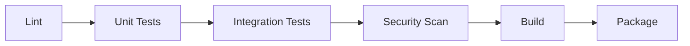

# CI/CD Validation — Generation Template

> **Domain:** build
> **Section:** cicd_validation
> **Source:** `documentation-standards/14-build-standards.md` §CI/CD Validation
> **Relationships:** `audit/deterministic/document/14-build-relationships.yaml`

Generate the CI/CD Validation section for a Build Plan document.

## Relationships

| Relationship | Target | Constraint |
|---|---|---|
| `derives_from` | engineering / build_standards | Gate sequence must align with Engineering(07) CI/CD configuration |
| `traces_to` | qa / test_strategy | Gate sequence must include QA(12) test gates |

## Template

```markdown
## CI/CD Validation

[1-2 sentence description of what CI/CD validation covers]
[Statement that this stage is conditional and applies to projects with automated pipelines]

### Gate Sequence



> **Failure policy:** [any gate failure blocks subsequent gates]
> **Deployment blocker:** [all gates must pass before deployment]
> **Notification:** [how failures are reported — alert channel, dashboard]
```

## Examples

**Correct:**
> Gate sequence: lint → unit tests → integration tests → security scan → build → package. A failure at any gate blocks subsequent gates. Deployment is blocked until all gates pass. Failures notify the team via the configured alert channel.

**Incorrect:**
> All CI/CD checks run in parallel. If a security check fails, the build continues and the artifact is deployed anyway.
> *Why wrong: CI/CD validation must enforce that failures block downstream stages — deploying artifacts that failed security checks defeats the purpose of the pipeline.*

## Writing Guidance

- **Tone:** prescriptive
- **Voice:** imperative
- **Structure:** paragraphs
- **Audience:** engineer
- **Do:** Define the gate sequence as an ordered list (lint → test → security → build); specify failure handling per gate; identify deployment blockers explicitly
- **Don't:** Allow parallel execution of dependent gates; omit failure handling policies; deploy artifacts that failed any gate

**Minimum content:** 2 paragraphs
**Length guidance:** concise
**Required diagrams:** flowchart (gate sequence)
**Required cross-references:** Engineering(07), QA(12)

## Audit Fix

<!-- Phase 5: populate with finding→generation handoff -->
